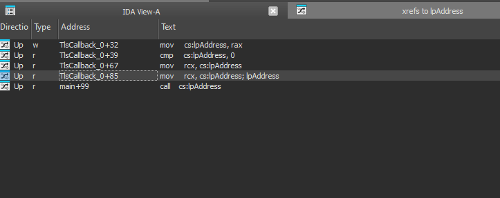
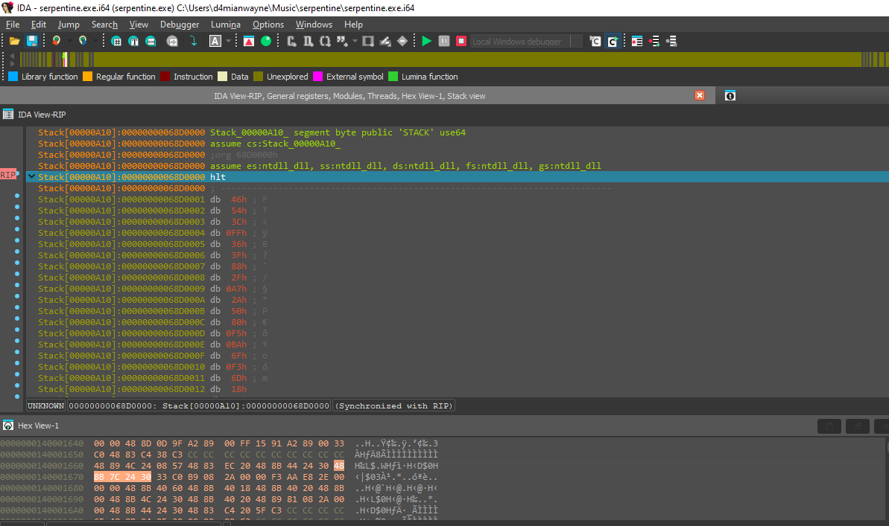

# Serpentine - Flare-On 11 (9th Challenge)

Author: Robin (@D4mianWayne), [PwnFuzz](https://www.pwnfuzz.com)  


This challenge was something I could not done last year, hence doing it right now to learn the missed steps along with good enough writeup to support my understanding. 

Loading the binary into the IDA, we see it does not have any obfuscation within the place and seems straightforward enough to navigate initially:


Though, as it appears to be very simple, we see it accepts a command line argument and compares whether it is of size 32 or not. If not, it will end saying wrong key length, very informative. 
Apart from this, the thing that stands out is the call of `lpAddress` and passing the `Destination` as first argument which contains our provided input. 

As I could not find other function off the bat where `lpAddress` was referenced, checking the cross-references helped in narrowing down where it might and to our surprise, it was in a function called `TlsCallback`



We see the `TlsCallback_0` registered in the `TlsCallback` table, meaning we are dealing with one of the registered callback that will be ran before we reach the main function. Given, what we see above, the callback function is initializing the shellcode which will gets called during the execution of the `main` .


```jsx
void __fastcall TlsCallback_0(__int64 a1, int a2)
{
  if ( a2 == 1 )
  {
    lpAddress = VirtualAlloc(0LL, 0x800000uLL, 0x3000u, 0x40u);
    if ( !lpAddress )
    {
      sub_1400053E4("Unable to allocate memory."); // print function
      sub_1400050E0(1LL); // exit function
    }
    sub_1400157D0(lpAddress, &unk_140097AF0, 0x800000LL); // memcpy
  }
  else if ( !a2 && !VirtualFree(lpAddress, 0LL, 0x8000u) )
  {
    sub_1400053E4("Unable to free memory.");
    sub_1400050E0(1LL);
  }
}
```

This functions is also rather straightforward, which does not makes sense as it was easy so far but perhaps the main challenge has not even begun, (rookie mistake!). It allocates a executable region of the memory and assign it to `lpAddress` , as the `sub_1400157D0` is performing `memcpy` on the `lpAddress` and copying the data from  `unk_140097AF0` , we can check what kind of instruction is stored there.

Looking at it, we can guess these are instructions for the assembly, presumably a shellcode which might be something we have to analyze dynamically.



---

Looking into the application more deeply, we could not directly find a trace for this, but the function at `140001430` , this function ends up calling **`RtlInstallFunctionTableCallback`** which adds a dynamic function table to the dynamic function table list. It registers a callback that is called when an exception occurs, in this case, as we could see the dynamic shellcode being loaded starts with the `hlt` instruction, it ends up creating an exception. The arguments are self-explanatory, what we are really looking is the `Callback` , other details are not needed as much as this one. But as we are learning, the gist of it is that when an exception occurs between the `BaseAddress` and `BaseAddress + Length` , it will end up executing the `Callback` function

```jsx
NTSYSAPI BOOLEAN RtlInstallFunctionTableCallback(
  [in] DWORD64                        TableIdentifier,
  [in] DWORD64                        BaseAddress,
  [in] DWORD                          Length,
  [in] PGET_RUNTIME_FUNCTION_CALLBACK Callback,
  [in] PVOID                          Context,
  [in] PCWSTR                         OutOfProcessCallbackDll
);
```

Looking into the x64Dbg for the information, we see that the 4th argument residing in the R9 points to the address of a RUNTIME function located at `1400010B0` 


The following functions seems to be doing a couple of things, much of them related to our shellcode which is at `lpAddress` , this function is rather simple to understand once we get hang of the structure. 

```jsx
PRUNTIME_FUNCTION __stdcall callback_function(DWORD64 ControlPc, PVOID Context)
{
  RUNTIME_FUNCTION *rt_func; // [rsp+28h] [rbp-20h]

  rt_func = operator new(12LL);
  rt_func->FunctionStart = (ControlPc - *(&unk_140898970 + 1518));// Subtracts the allocated base address of shellcode from the PC during the execution
  rt_func->FunctionEnd = (rt_func->FunctionStart + 1);
  rt_func->UnwindInfo = (rt_func->FunctionEnd + *(ControlPc + 1) + 1);
  rt_func->UnwindInfo = (rt_func->UnwindInfo + ((rt_func->UnwindInfo & 1) != 0));
  return rt_func;
}
```

```jsx
typedef struct _IMAGE_RUNTIME_FUNCTION_ENTRY {
  DWORD BeginAddress;
  DWORD EndAddress;
  union {
    DWORD UnwindInfoAddress;
    DWORD UnwindData;
  } DUMMYUNIONNAME;
} RUNTIME_FUNCTION, *PRUNTIME_FUNCTION, _IMAGE_RUNTIME_FUNCTION_ENTRY, *_PIMAGE_RUNTIME_FUNCTION_ENTRY;
```

Before diving in, we need to understand few things, especially the `RUNTIME_FUNCTION` , so first we have the `rt_func` start address being set to the `ControlPc - lpAddress`  which we will see dynamically, so once the `FunctionStart` is calculated then the `FunctionEnd` is set to the `FunctionStart + 1` and then we have `UnwindInfo` , it contains two members, one being the `UnwindInfoAddress` which is where the `UNWIND_INFO` structure is associated.
